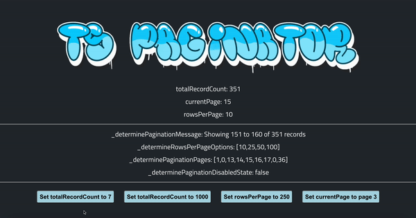

# ts-paginator

<div style="display: flex">    
  
  
</div>

<br />

<div style="display: flex">
    
    
</div>

<br />


<br />

> ### `ts-paginator` is a TypeScript pagination hook for React or NextJS

<br />

## Args

Instantiate the `useTsPaginator` hook with the following arguments:

| Args                             | Description                               |
| -------------------------------- | ----------------------------------------- |
| `totalRecordCount: number`       | The total count of records                |
| `currentPage: number`            | The current page selection (zero indexed) |
| `rowsPerPage: 10` (default `10`) | The current rows per page selection       |

<br />

## UI/UX Functions

| Function                           | Description                                                  | Args                       | Return Type | Example Returns                    |
| ---------------------------------- | ------------------------------------------------------------ | -------------------------- | ----------- | ---------------------------------- |
| `determinePaginationMessage`       | Calculates the pagination message                            | `options?: {verb: string}` | string      | `Displaying 1 to 10 of 10 records` |
| `determineRowsPerPageOptions`      | Calculates the rows per page options                         |                            | number[]    | `[10]`                             |
| `determinePaginationDisabledState` | Can be used to disable the previous page or next page button |                            | boolean     | `true`                             |

<br />

## State Altering Functions

| Function                       | Description                    | Args                          | Return Type |
| ------------------------------ | ------------------------------ | ----------------------------- | ----------- |
| `handleChangeTotalRecordCount` | Changes the total record count | `newTotalRecordCount: number` | void        |
| `handleChangeRowsPerPage`      | Changes the rows per page      | `newRowsPerPage: number`      | void        |
| `handleChangePage`             | Changes the current page       | `newPage: number`             | void        |

<br />

## Extra Functions

Not required to build working pagination, but might be useful. Coming soon.

<br />

## Usage

`npm i --save ts-paginator`

```js
import useTsPaginator from 'ts-paginator';

function MyComponent() {
  const {
    totalRecordCount,
    rowsPerPage,
    currentPage,
    _determinePaginationMessage,
    _determinePaginationDisabledState,
    _determineRowsPerPageOptions,
    _handleChangeTotalRecordCount,
    _handleChangeRowsPerPage,
    _handleChangePage,
  } = useTsPaginator(20, 0);

  const message = _determinePaginationMessage({ verb: 'Showing' }); // Showing 1 to 10 of 20 records

  return <p>{message}</p>;
}
```


